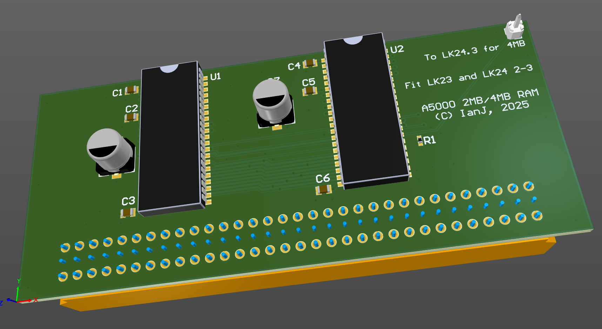

# A5000 2MB/4MB

April 2025

A 2MB upgrade board for A5000.  With the addition of a flying wire, can be used as a full 4MB - idea stolen directly from Ian Stocks.

This has NOT been built or tested.

## Licence

No warranty is provided, and this work is used at your own risk.  

Licenced as CC BY-SA 4.0

Copyright 2025 Ian Jeffray

