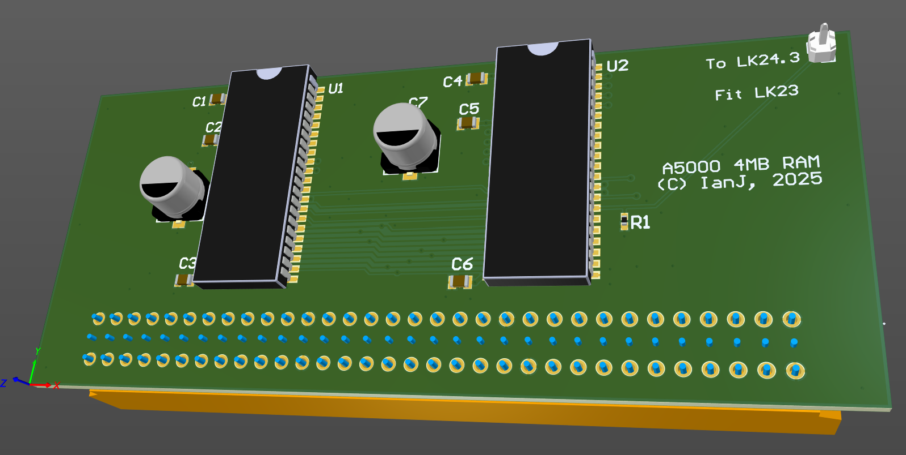

# A5000 4MB

May 2025

A 4MB upgrade board for A5000.  Requires flying wire - idea accidentally stolen directly from Ian Stocks; the onboard RAM is set as fully disabled (can be 1M, 2M, 4M, or none at all on the motherboard), but the 'RA9' signal is not provided on the RAM connector, hence the need for the short flying wire.

This has been built and tested successfully.

## Licence

No warranty is provided, and this work is used at your own risk.  

Licenced as CC BY-SA 4.0

Copyright 2025 Ian Jeffray

